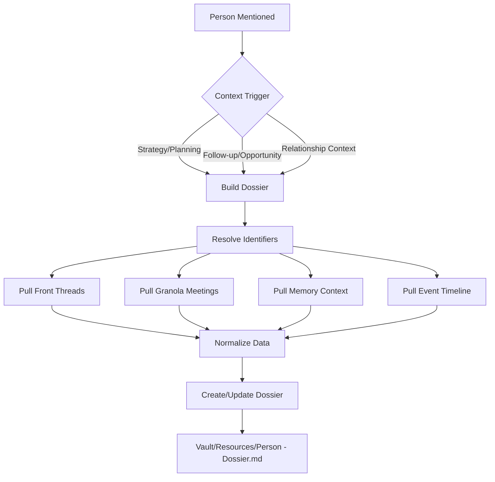

# ADR-0073: Automatic Person Dossier System

## Status

Proposed

## Context

When discussing individuals in strategy conversations, follow-ups, deal opportunities, or relationship context, agents need comprehensive background information. Currently, this requires manual searches across multiple systems:
- Front email threads
- Granola meeting transcripts
- Qdrant memory observations
- Inngest event logs

This fragmentation leads to:
- Incomplete context when making decisions
- Repeated searches for the same person
- Lost context between sessions
- No unified view of relationships

## Decision

Implement an **automatic Person Dossier System** that:

1. **Triggers automatically** when a person is discussed in qualifying contexts
2. **Aggregates evidence** from Front, Granola, memory, and events
3. **Maintains structured dossiers** in `Vault/Resources/<Person Name> - Dossier.md`
4. **Separates verified from inferred** information with clear labeling
5. **Updates incrementally** without destroying historical data

### Architecture



### Dossier Schema

Each dossier contains six required sections:
1. **All Email Threads** — Front conversations with IDs, subjects, dates
2. **Key Topics Discussed** — Recurring themes across all sources
3. **Projects Mentioned** — Named initiatives and collaborations
4. **Properties or Deals Referenced** — Assets, opportunities, transactions
5. **Timeline of Interactions** — Chronological record by channel
6. **Current Status of Open Items** — Action items with owners and next steps

### Data Sources and Confidence Levels

| Source | Command | Confidence | Use For |
|--------|---------|------------|---------|
| Front API | `joelclaw email inbox/read` | Verified | Email threads, exact quotes |
| Granola MCP | `granola meetings --transcript` | Verified | Meeting content, decisions |
| Qdrant Memory | `joelclaw recall` | Inferred | Historical context, patterns |
| Event Bus | `joelclaw events` | Inferred | Timeline, system interactions |

### Quality Rules

1. **No fabrication** — Only facts from evidence sources
2. **Label confidence** — "Verified from Front" vs "Inferred from memory"
3. **Preserve history** — Append new timeline entries, never delete
4. **Dedupe by key** — `channel + source_id + date + summary`
5. **Block explicitly** — If data unavailable, state exact gaps

### Trigger Model

**Immediate triggers** (build now):
- Strategy or planning discussions mentioning a person
- Follow-up decision points
- Deal/opportunity evaluation
- Relationship context questions

**Async refresh** (scheduled):
- Weekly refresh for active contacts
- Monthly refresh for dormant contacts
- Event-driven refresh on new email/meeting

### Event Bus Integration

```typescript
// On person mention in qualifying context
inngest.send({
  name: "person/dossier.requested",
  data: {
    name: "Person Name",
    email: "email@example.com",
    context: "strategy_discussion",
    requestedBy: "gateway"
  }
});

// Dossier function
inngest.createFunction(
  { id: "person-dossier-build" },
  { event: "person/dossier.requested" },
  async ({ event, step }) => {
    // Implementation following skill workflow
  }
);
```

## Implementation Plan

### Phase 1: Manual Trigger (Immediate)
1. Implement skill as documented
2. Agent manually runs workflow when person discussed
3. Validate dossier quality and completeness

### Phase 2: Event-Driven (Next Sprint)
1. Add Inngest function for async dossier building
2. Gateway detects person mentions and triggers
3. Background refresh for active contacts

### Phase 3: Proactive Intelligence (Future)
1. Pre-build dossiers for upcoming meetings
2. Refresh before scheduled calls
3. Alert on significant relationship changes

## Consequences

### Positive
- Complete person context available instantly
- No more fragmented searches across systems
- Historical interactions preserved
- Clear evidence trail for all claims

### Negative
- Storage growth in Vault (mitigated by text-only format)
- API rate limits on Front/Granola (mitigated by caching)
- Privacy considerations for detailed tracking

### Alternative Considered
- Real-time aggregation without persistence → rejected due to repeated API costs
- Single source of truth (Front only) → rejected due to incomplete context
- Structured database → rejected in favor of human-readable markdown

## Verification Checklist

- [ ] Skill creates dossier for test person
- [ ] Front threads correctly extracted and linked
- [ ] Granola meetings found and summarized
- [ ] Timeline dedupes repeated interactions
- [ ] Verified vs inferred clearly labeled
- [ ] Update preserves existing content
- [ ] Blockers produce explicit gap documentation
- [ ] Evidence index links to source IDs