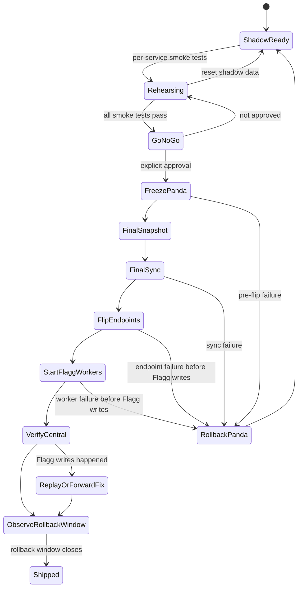

# Flagg Gate 5 staged migration plan

Gate 5 is the Flagg **Central** cutover phase for ADR-0246.

This plan reconciles two constraints:

1. Joel wants to migrate and smoke-test services individually.
2. ADR-0246 forbids long-lived split-brain Central.

The safe shape is **staged proof, atomic authority**: rehearse and smoke-test each service individually, but do not leave Panda and Flagg sharing authoritative Central ownership. Stateful authority flips only inside an approved cutover window with Panda writes frozen.

## Status

Draft plan. Do not execute without explicit go/no-go.

Project Thread for approvals, milestone updates, blockers, and smoke-test evidence:

- https://eggheadio.slack.com/archives/C09LKT871PE/p1779975813335049

Gate 4 is complete: Flagg shadow Central recovered after hard reboot with no GUI login.

Gate 5 Phase A stateful-service shadow smoke passed on 2026-05-28. Receipt on Flagg:

```text
/Users/Shared/joelclaw/logs/central/smoke/phase-a-20260528T162118Z.log
```

Verified services: Redis, Typesense, Inngest, Restate, and MinIO. This was shadow-only; Panda was not frozen and no endpoints were flipped.

Gate 5 is not complete until Flagg owns Central state, workers, endpoints, and verification while Panda is frozen as rollback-only.

## Definitions

- **Shadow smoke test**: a test against Flagg using shadow data or isolated writes. Safe before cutover.
- **Migration rehearsal**: a repeatable state copy into Flagg while Panda remains authoritative. Safe if Flagg services do not feed live Central clients.
- **Authority flip**: the moment a service becomes the source of truth for Central. Requires the write freeze gate.
- **Rollback point**: the latest state from which Panda can still resume cleanly without replaying Flagg writes.
- **Split-brain**: any state where Panda and Flagg both accept authoritative Central writes for the same service family. Forbidden.

## What “refactoring the deploy system” means

Avoid this during Gate 5 unless a blocker forces it:

- replacing the deploy abstraction,
- rebuilding CI/CD around the new host,
- changing how `joelclaw deploy` works,
- rewriting service discovery,
- replacing worker packaging,
- adding a new supervisor/runtime family,
- generalizing Flagg migration scripts into a universal platform.

Gate 5 can add small, boring scripts if needed for migration proof. It should not become “while we are here, let's rebuild deployment.” That is how a migration turns into a swamp with receipts.

## What “making Flagg perfect” means

Good idea. Wrong gate.

Create a post-cutover hardening backlog instead of blocking Central migration on perfection:

- demote Joel from admin after confidence window,
- verify backup/restore with a real restore drill,
- add service-native export/import for Redis, Typesense, MinIO, and Restate where needed,
- improve health summaries and OTEL dashboards,
- make worker deployment boring from one command,
- harden secrets and move toward the Credential Proxy direction from `CONTEXT.md`,
- clean Flagg GitHub SSH/fetch,
- prune shadow leftovers,
- document “remote dev box, not service owner” boundaries.

Perfection is a Phase 6/hardening board, not a Gate 5 prerequisite.

## Gate 5 state machine



The nasty edge: once Flagg accepts authoritative writes, rollback is no longer a simple flip-back. It becomes replay/repair. That is the line we do not cross casually.

## Service order

### Phase A — shadow service smoke tests

These can run before cutover. They prove Flagg services are alive and compatible without making them authoritative.

| Order | Service | Shadow smoke test | Split-brain risk |
| --- | --- | --- | --- |
| 1 | Redis | `PING`, test isolated key write/read/delete, inspect persistence after restart | Low if test keys are namespaced and no live clients point at it |
| 2 | Typesense | `/health`, create temp collection, import/search/delete temp docs | Low if temp collection only |
| 3 | Inngest | `/health`, dev-server/API reachability, worker registration smoke against Flagg-only endpoint | Medium if live events point here early |
| 4 | Restate | ingress/admin/metrics ports, register temp service, invoke no-op workflow if available | Medium if live workers use mixed Restate/Redis/Inngest |
| 5 | MinIO | ready health, temp bucket/object write/read/delete | Low if temp bucket only |
| 6 | system-bus-worker | start against Flagg env in isolated mode, verify `/api/inngest`, do not register against Panda | High if it consumes live Panda events while writing Flagg state |
| 7 | restate-worker | start against Flagg Restate in isolated mode, run no-op DAG | High if it drains live Panda queues |
| 8 | gateway bridge | send a private test notification through Flagg path only | High if inbound channels are double-consumed |
| 9 | Run capture/search | capture a test Run to Flagg, search it, delete/reset if needed | High if client Machines post to both Centrals |

### Phase B — migration rehearsal

Copy or rebuild data into Flagg while Panda remains authoritative.

Rules:

- Flagg remains isolated from live writers.
- Every rehearsal is idempotent.
- Every rehearsal has a reset path.
- Evidence is logged with timestamp, source, destination, record counts, and smoke result.

Recommended per-service rehearsal stance:

| Service | Source of truth | Rehearsal approach | Cutover stance |
| --- | --- | --- | --- |
| Redis | Panda runtime state | Snapshot/copy only if state is needed; otherwise drain/empty at cutover | Prefer drain/quiet over migrating stale queues |
| Typesense | Mixed: memory Runs rebuildable from NAS; OTEL/search collections may need export | Export/import collections or rebuild memory collections from NAS | Must know which collections are authoritative vs derived |
| Inngest | Panda event/run DB | Prefer drain active runs, then start Flagg clean unless history is required | Do not dual-deliver events |
| Restate | Panda workload journal | Prefer no active jobs at cutover; do not migrate poisoned/active journals casually | Drain/cancel workloads before flip |
| MinIO | Object data if still used | Bucket sync / object inventory diff | Only include wave 1 buckets actually used by Central |
| Workers | Code + env | Start against Flagg services after state is staged | Workers start after stateful services are Flagg-authoritative |
| Gateway | Channel ingress + queue bridge | Private test path only | Inbound channels flip last |
| Runs/memory | NAS + Typesense | Rebuild/import search index; capture test Run | Capture endpoint flips after Flagg search works |

### Phase B inventory dry-run — 2026-05-28

Read-only Panda inventory found:

| Service | Panda state observed | Gate 5 stance |
| --- | --- | --- |
| Redis | 26 keys in db0: 11 `joelclaw:*`, 9 `memory:*`, 2 `health:*`, plus `nas:*`, `knowledge:*`, `heartbeat:*`, `granola:*`. Queue state includes `joelclaw:queue:events` stream length 141 and `joelclaw:queue:priority` zset size 141; consumer group `joelclaw:queue:system-bus` has lag 141 and pending 0. | Snapshot/copy only after freeze if preserving gateway/runtime continuity. Do not blindly replay the 141 queued events; drain or explicitly discard stale queue entries. Health/heartbeat/watchdog timestamps can start clean. |
| Typesense | 22 collections, largest: `otel_events` 1,972,228 docs, `docs_chunks_v2` 228,939, `slack_messages` 33,262, `memory_observations` 28,046, `run_chunks_dev` 18,362, `runs_dev` 11,064. No aliases. Typesense resident memory ~5.0GB. | Export/import or rebuild by collection. Treat `runs_dev`, `run_chunks_dev`, `memory_observations`, `otel_events`, `gateway_behavior_history`, and `machines_dev` as continuity candidates. Rebuild obvious derived indexes (`docs*`, `vault_notes`, `blog_posts`, `system_knowledge`) where source-of-truth replay is cheaper and safer. |
| Inngest | `/data/main.db` is 17.5GB. Tables: 2 apps, 155 functions, 221,060 events, 98,093 runs, 96,835 finishes, 1,481,631 history rows, 1,198,599 traces, 2,113,373 spans. Last event/run timestamps are 2026-05-20. There are 1,258 unfinished runs; top unfinished are `queue/observer` 697, `slack-channel-backfill` 174, `memory/run.captured` 107, `channel-message-classify` 105, `system/content-sync` 73. | Prefer archive/snapshot Panda Inngest DB and start Flagg clean after drain/freeze. Migrating the 17.5GB DB would preserve history but also carries stale unfinished work. The unfinished set needs explicit cancel/discard decision before cutover. |
| Restate | Admin API reports `services: []`, `deployments: []`; `/restate-data` is 840KB with only cluster marker observed. | Start clean. No workload journal migration needed unless new jobs appear before cutover. |
| MinIO | No MinIO/Aistor/S3 resources in Panda k8s, no listening host ports 9000/9001/30900/30901/31000/31001. Repo manifest exists but is not applied. | Start clean or omit from wave 1 unless another object-store source is identified. |

This inventory created temporary read-only SQLite inspection pods for Inngest and deleted them immediately after logs were collected. No Panda freeze, endpoint flip, queue drain, data copy, or cutover happened.

### Flagg NAS persistence check — 2026-05-28/30

Current proved state:

- Flagg's real 10GbE interface is `en0`, not the stale `en10` assumption. `en0` has `192.168.1.10` and reports `10Gbase-T`.
- `three-body` is `192.168.1.163`.
- NFS `2049/tcp` is reachable over `en0` after Wi-Fi/route drift is corrected.
- `/Volumes/nas-nvme` mounts from `192.168.1.163:/volume2/data`.
- `/Volumes/three-body` mounts from `192.168.1.163:/volume1/joelclaw`.
- route MTU is currently proved at `8192`. Bounded jumbo-frame tests showed full MTU `9000` fails (`ping -D -s 8972 192.168.1.163`), but practical jumbo MTU `8192` passes (`ping -D -s 8164 192.168.1.163`) with 0% loss. Treat full `9000` as a switch/NAS path follow-up, not a Gate 5 NAS write blocker.
- tuned NFS defaults at MTU `8192`: `rw,resvport,nfsvers=3,tcp,soft,intr,timeo=10,retrans=2,rsize=524288,wsize=524288,dsize=65536,readahead=128`.
- NAS object roots exist and show `uid=502`, `gid=20`, mode `2777`:
  - `/Volumes/nas-nvme/s3`
  - `/Volumes/three-body/s3`
- `three-body` has a Linux passwd/group identity for Flagg's service user: `joelclaw` uid `502`, `staff` gid `20`.
- Local writes on `three-body` to both object roots succeed as NAS user `joel`.
- Flagg NFS writes now succeed from the `joelclaw` service user against both object roots.

Working ASUSTOR NFS setting for both shared folders `data` and `joelclaw`:

```text
Client: 192.168.1.10
Privilege: Read & Write
root Mapping: admin (999)
Asynchronous: Yes
Allow connections from non-reserved ports (ports greater than 1024): enabled
```

Runtime `/etc/exports` / `exportfs -v` shape for Flagg after that GUI setting:

```text
192.168.1.10(rw,async,root_squash,anonuid=999,anongid=999,subtree_check,no_wdelay,insecure)
```

The initially recommended `root Mapping: root (0)` generated `no_root_squash,anonuid=0,anongid=0,insecure`, but Flagg writes still failed with `Operation not permitted`. Mapping root to ASUSTOR `admin (999)` is the setting that made Flagg NFS writes pass. The broader `192.168.1.0/24` rules already existed for other machines; leave them in place unless deliberately reworking NAS access.

Proof receipts from the original 2026-05-30 write test and the tuned 2026-06-17 remount:

```bash
# mounted after Flagg reboot with tuned 8192-MTU proof options
sudo env \
  NAS_EXPECTED_INTERFACE=en0 \
  NAS_EXPECTED_MTU=8192 \
  NAS_NFS_OPTIONS='rw,resvport,nfsvers=3,tcp,soft,intr,timeo=10,retrans=2,rsize=524288,wsize=524288,dsize=65536,readahead=128' \
  ./infra/central/scripts/mount-nas.sh mount

sudo -u joelclaw -H mkdir /Volumes/nas-nvme/s3/.svc-proof && sudo -u joelclaw -H rmdir /Volumes/nas-nvme/s3/.svc-proof
sudo -u joelclaw -H mkdir /Volumes/three-body/s3/.svc-proof && sudo -u joelclaw -H rmdir /Volumes/three-body/s3/.svc-proof

sudo -u joelclaw -H env NAS_EXPECTED_INTERFACE=en0 NAS_EXPECTED_MTU=8192 \
  ./infra/central/scripts/verify-nas.sh --write-probe --benchmark-mib 1

sudo -u joelclaw -H env NAS_EXPECTED_INTERFACE=en0 NAS_EXPECTED_MTU=8192 \
  ./infra/central/scripts/verify-nas.sh --write-probe --benchmark-mib 64
```

The 64 MiB verification reported all route/media/mount checks ok and both object paths writable/benchmarked:

```text
ok   nfs port reachable
ok   route uses expected 10GbE interface
ok   interface media is 10GbE
ok   route MTU matches ADR-0088 target
ok   nas-nvme mounted
ok   nas-nvme mount is nfs
ok   nas-hdd mounted
ok   nas-hdd mount is nfs
ok   nas-nvme hot object path writable/benchmarked
ok   nas-hdd cold object path writable/benchmarked
```

Still not complete: hard-reboot/no-GUI NAS verification remains the next proof before Gate 5 can use NAS-backed object storage.

### 2026-06-17 LAN mount contract correction

Flagg and `three-body` sit on the same shelf/LAN, so persistent storage mounts are a LAN-IP contract. Tailscale/MagicDNS remains useful for SSH/admin/remote access, but it is not the default data plane for NFS.

Audit receipt:

- On Flagg, `three-body` resolved to `three-body.tail7af24.ts.net` / `100.67.156.41` and routed over `utun1`.
- The NAS LAN IP `192.168.1.163` routed over `en0`.
- The ASUSTOR NFS exports are LAN-scoped around `192.168.1.0/24` and selected LAN hosts.
- Old launchd logs showed repeated `mount_nfs: can't mount /volume2/data from three-body onto /Volumes/nas-nvme: Permission denied`.

The root bug: `infra/central/scripts/common.sh` built NFS export strings from `NAS_HOST=three-body`, while the route checks used `NAS_IP=192.168.1.163`. That let a check prove the LAN route while the actual mount used MagicDNS/Tailscale. The scripts now default `CENTRAL_NAS_NVME_EXPORT` and `CENTRAL_NAS_HDD_EXPORT` to `NAS_IP`, and preflight/verify/mount NFS reachability checks probe `NAS_IP`.

Resolution receipt: the direct LAN failure was macOS Local Network privacy for the invoking app. After allowing local-network access from the GUI prompt, `nc -vz -G 3 192.168.1.163 2049` and `showmount -e 192.168.1.163` succeeded. A Terminal runner then synced the fixed NAS scripts into `/Users/Shared/joelclaw/src/joelclaw`, installed and bootstrapped `com.joelclaw.central.nas-mounts`, mounted both NFS tiers, and passed `verify-nas.sh --write-probe --benchmark-mib 64`.

Live proof on 2026-06-17:

```text
/Volumes/nas-nvme -> 192.168.1.163:/volume2/data
/Volumes/three-body -> 192.168.1.163:/volume1/joelclaw
launchd label: system/com.joelclaw.central.nas-mounts
last exit code: 0
```

### Gate 5 NAS/object-storage target

MinIO should be an interface to `three-body`, not a pile of object data hidden on Flagg's local SSD. Local MinIO storage under `/Users/Shared/joelclaw/services/minio` is shadow-smoke-only.

Target tiering:

| Tier | Path | Backing storage | Use |
| --- | --- | --- | --- |
| Local SSD | `/Users/Shared/joelclaw/services/*` | Flagg internal SSD | Redis, Inngest, Restate, active Typesense, caches/scratch |
| NAS NVMe | `/Volumes/nas-nvme` | `192.168.1.163:/volume2/data` | fast shared artifacts, snapshots, models, docs artifacts, sessions, transcripts, hot object data |
| NAS HDD | `/Volumes/three-body` | `192.168.1.163:/volume1/joelclaw` | archives, books, bulk object data, cold retention |

Do not mix NAS NVMe and NAS HDD into one opaque MinIO erasure set. Preferred shape is either:

1. two explicit S3 surfaces: hot MinIO backed by NAS NVMe and cold MinIO backed by NAS HDD; or
2. one hot MinIO surface backed by NAS NVMe plus explicit lifecycle/copy jobs to NAS HDD.

Before cutover, prove the selected shape with:

- persistent no-login mounts for `/Volumes/nas-nvme` and `/Volumes/three-body` over the NAS LAN IP, or an explicitly scoped fallback for non-MinIO backup/export paths;
- route/MTU proof showing Flagg uses 10GbE to `three-body`, not Tailscale/Wi-Fi;
- read/write latency and throughput receipts against both NAS tiers;
- MinIO bucket/object smoke tests that prove writes land on NAS-backed storage.

Repo-managed NAS proof scripts now live under `infra/central/scripts/`:

- `install-nas-mounts.sh` — installs the root `com.joelclaw.central.nas-mounts` LaunchDaemon and prepares `/Volumes/nas-nvme` + `/Volumes/three-body`.
- `mount-nas.sh` — mount/status/unmount action with route, NFS, 10GbE media, and MTU checks.
- `verify-nas.sh` — non-privileged proof script for route/media/MTU/mounts plus optional write/read benchmarks against `CENTRAL_MINIO_HOT_DATA` and `CENTRAL_MINIO_COLD_DATA`.
- `smoke/nas.sh` — smoke harness wrapper for NAS write probes when `CENTRAL_REQUIRE_NAS=1`.

The NAS mount lifecycle is: `boot/kickstart -> wait_for_route -> assert_10gbe_media -> mount_nas_nvme -> mount_nas_hdd -> verify_mounts -> ready | failed_retry_next_interval`.

### Phase C — coordinated authority cutover

This is the actual Gate 5.

Preconditions:

- Joel approves the go/no-go.
- Project Thread is approved or explicitly declined.
- Panda health is green enough to snapshot.
- Flagg Gate 4 reboot proof remains valid.
- Flagg shadow smoke tests pass.
- Flagg has a documented and reboot-proven `three-body` NAS access path, including `/Volumes/nas-nvme`, `/Volumes/three-body`, 10GbE route proof, and performance receipt.
- Active loops/runs/workloads are drained, cancelled, or explicitly accepted as disposable.
- Rollback commands are written before the freeze.

Cutover sequence:

1. Announce cutover start and freeze window.
2. Stop/disable Panda write-producing workers.
3. Stop loop/workload dispatch.
4. Snapshot Panda state.
5. Final-sync selected state to Flagg.
6. Start/verify Flagg stateful services.
7. Flip Central endpoint config to Flagg.
8. Start Flagg workers.
9. Send a known event through Flagg.
10. Verify Inngest run execution on Flagg.
11. Verify Restate workload no-op on Flagg.
12. Verify OTEL emit/query on Flagg.
13. Verify Run capture/search on Flagg.
14. Verify gateway notification path.
15. Keep Panda frozen as rollback-only until rollback window closes.

## Acceptance criteria

- [x] Each stateful service has a shadow smoke-test receipt. Flagg receipt: `/Users/Shared/joelclaw/logs/central/smoke/phase-a-20260528T162118Z.log`.
- [ ] Each stateful service has a rehearsal/reset path or an explicit “start clean” decision.
- [ ] Panda write freeze procedure is documented and tested dry-run where safe.
- [ ] Active Panda workloads are drained/cancelled before final sync.
- [ ] Flagg owns Redis, Typesense, Inngest, Restate, MinIO wave-1 state after cutover.
- [ ] Flagg workers execute against Flagg state only.
- [ ] Flagg has reboot-proven NAS access to `three-body` for rebuilds/artifacts/backups/object storage, with 10GbE route proof and latency/throughput receipts.
- [ ] MinIO wave-1 data is NAS-backed, not local Flagg SSD, or MinIO is explicitly omitted from wave 1.
- [ ] Clients and relay paths post to Flagg Central only.
- [ ] Panda Central stack is stopped/frozen and labelled rollback-only.
- [ ] At least one known event completes through Flagg Inngest.
- [ ] At least one no-op workload completes through Flagg Restate.
- [ ] OTEL emit/query works through Flagg.
- [ ] Run capture/search works through Flagg.
- [ ] Gateway can notify Joel through the Flagg path.
- [ ] Post-cutover hard-reboot/no-GUI proof still passes.
- [ ] ADR-0246 is updated from `accepted` to `shipped` only after verification.

## Out of scope for Gate 5

- Demoting Joel from admin.
- Migrating PDS unless explicitly added to wave 1.
- Replacing launchd + Colima/Compose with a different runtime.
- Rewriting `joelclaw deploy`.
- Creating active/active Central.
- Making Panda a hot Central fallback.
- Full Credential Proxy hardening.
- Perfect dashboards.
- Cleaning every historical Panda artifact.

## Open decisions

1. Which Typesense collections must be exported/imported vs rebuilt from NAS?
2. Is Inngest run history worth migrating, or do we drain and start clean?
3. Is Restate journal migration worth attempting, or do we require no active workloads?
4. Which MinIO buckets are actually wave 1?
5. Does gateway move in Gate 5 or remain on Panda as Relay while pointing at Flagg Central?
6. What is the rollback window cutoff after Flagg accepts writes?
7. Should we create a `#brain-joel` Project Thread for Gate 5 evidence?
8. Closed for Central: use root LaunchDaemon-mounted NFS for `/Volumes/nas-nvme` and `/Volumes/three-body`. Autofs can be considered later for Joel's interactive/user mounts, not Central service mounts.
9. Should MinIO wave 1 use two explicit hot/cold S3 surfaces, or one hot S3 surface plus lifecycle/copy jobs to HDD?

## Phase A smoke harness

Repo-managed scripts live under `infra/central/scripts/smoke/`:

- `redis.sh` — isolated temp key write/read/delete.
- `typesense.sh` — temp collection create/index/search/delete.
- `inngest.sh` — health check plus isolated `central/smoke.test` event submit.
- `restate.sh` — ingress/admin/metrics reachability.
- `minio.sh` — temp bucket/object write/read/delete through the S3 API.
- `nas.sh` — route/mount/write-probe check; included automatically when `CENTRAL_REQUIRE_NAS=1`.
- `run.sh` — aggregate harness that writes a receipt under `${CENTRAL_LOG_DIR}/smoke/`.

Run from Flagg's service checkout as the `joelclaw` service user so `.env` stays private and readable only to the runtime identity:

```bash
ssh -t joel@flagg 'cd /Users/Shared/joelclaw/src/joelclaw && sudo -u joelclaw -H ./infra/central/scripts/smoke/run.sh'
```

This performs isolated shadow writes only. It does not freeze Panda, flip endpoints, or make Flagg authoritative.

## Recommended next work

NAS writes are now proved from Flagg after mapping the Flagg NFS client to ASUSTOR `admin (999)` and using tuned 8192-MTU proof mounts. The service checkout has been synced to the LAN-IP export contract and `NAS_EXPECTED_MTU=8192`, and its verifier passed with `expected_mtu=8192`. Continue with the remaining NAS hardening/proof steps; do not cut over Central yet.

1. Hard-reboot Flagg, then before any GUI login repeat the NAS proof over the 10GbE path:
   ```bash
   sudo ifconfig en0 mtu 8192
   cd /Users/Shared/joelclaw/src/joelclaw
   sudo env NAS_EXPECTED_INTERFACE=en0 NAS_EXPECTED_MTU=8192 \
     NAS_NFS_OPTIONS='rw,resvport,nfsvers=3,tcp,soft,intr,timeo=10,retrans=2,rsize=524288,wsize=524288,dsize=65536,readahead=128' \
     ./infra/central/scripts/mount-nas.sh mount
   sudo -u joelclaw -H env NAS_EXPECTED_INTERFACE=en0 NAS_EXPECTED_MTU=8192 \
     ./infra/central/scripts/verify-nas.sh --write-probe --benchmark-mib 64
   ```
2. Keep the 512K NFS transfer defaults unless a larger sweep beats them on both NAS tiers. The 2026-06-17 sweep picked 512K because 1M regressed HDD writes.
3. Fix or explicitly document MTU `8192` vs ADR-0088 target `9000`. Full `9000` still blackholes large packets to `three-body` from Flagg; inspect the switch path before trying to make `9000` the persistent default.
4. Decide MinIO wave-1 shape: two hot/cold S3 surfaces, or one hot surface plus lifecycle/copy jobs to HDD.
5. Write the freeze/rollback command sheet before any final sync.
6. Decide the open questions above before scheduling Gate 5.
7. Turn the ad hoc Panda inventory probes into a repo-managed read-only inventory script if we need repeatability before the cutover window.
