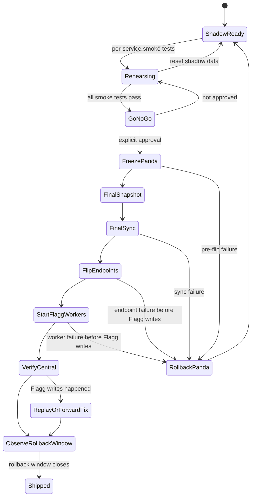

# Flagg Gate 5 staged migration plan

Gate 5 is the Flagg **Central** cutover phase for ADR-0246.

This plan reconciles two constraints:

1. Joel wants to migrate and smoke-test services individually.
2. ADR-0246 forbids long-lived split-brain Central.

The safe shape is **staged proof, atomic authority**: rehearse and smoke-test each service individually, but do not leave Panda and Flagg sharing authoritative Central ownership. Stateful authority flips only inside an approved cutover window with Panda writes frozen.

## Status

Draft plan. Do not execute without explicit go/no-go.

Project Thread for approvals, milestone updates, blockers, and smoke-test evidence:

- https://eggheadio.slack.com/archives/C09LKT871PE/p1779975813335049

Gate 4 is complete: Flagg shadow Central recovered after hard reboot with no GUI login.

Gate 5 is not complete until Flagg owns Central state, workers, endpoints, and verification while Panda is frozen as rollback-only.

## Definitions

- **Shadow smoke test**: a test against Flagg using shadow data or isolated writes. Safe before cutover.
- **Migration rehearsal**: a repeatable state copy into Flagg while Panda remains authoritative. Safe if Flagg services do not feed live Central clients.
- **Authority flip**: the moment a service becomes the source of truth for Central. Requires the write freeze gate.
- **Rollback point**: the latest state from which Panda can still resume cleanly without replaying Flagg writes.
- **Split-brain**: any state where Panda and Flagg both accept authoritative Central writes for the same service family. Forbidden.

## What “refactoring the deploy system” means

Avoid this during Gate 5 unless a blocker forces it:

- replacing the deploy abstraction,
- rebuilding CI/CD around the new host,
- changing how `joelclaw deploy` works,
- rewriting service discovery,
- replacing worker packaging,
- adding a new supervisor/runtime family,
- generalizing Flagg migration scripts into a universal platform.

Gate 5 can add small, boring scripts if needed for migration proof. It should not become “while we are here, let's rebuild deployment.” That is how a migration turns into a swamp with receipts.

## What “making Flagg perfect” means

Good idea. Wrong gate.

Create a post-cutover hardening backlog instead of blocking Central migration on perfection:

- demote Joel from admin after confidence window,
- verify backup/restore with a real restore drill,
- add service-native export/import for Redis, Typesense, MinIO, and Restate where needed,
- improve health summaries and OTEL dashboards,
- make worker deployment boring from one command,
- harden secrets and move toward the Credential Proxy direction from `CONTEXT.md`,
- clean Flagg GitHub SSH/fetch,
- prune shadow leftovers,
- document “remote dev box, not service owner” boundaries.

Perfection is a Phase 6/hardening board, not a Gate 5 prerequisite.

## Gate 5 state machine



The nasty edge: once Flagg accepts authoritative writes, rollback is no longer a simple flip-back. It becomes replay/repair. That is the line we do not cross casually.

## Service order

### Phase A — shadow service smoke tests

These can run before cutover. They prove Flagg services are alive and compatible without making them authoritative.

| Order | Service | Shadow smoke test | Split-brain risk |
| --- | --- | --- | --- |
| 1 | Redis | `PING`, test isolated key write/read/delete, inspect persistence after restart | Low if test keys are namespaced and no live clients point at it |
| 2 | Typesense | `/health`, create temp collection, import/search/delete temp docs | Low if temp collection only |
| 3 | Inngest | `/health`, dev-server/API reachability, worker registration smoke against Flagg-only endpoint | Medium if live events point here early |
| 4 | Restate | ingress/admin/metrics ports, register temp service, invoke no-op workflow if available | Medium if live workers use mixed Restate/Redis/Inngest |
| 5 | MinIO | ready health, temp bucket/object write/read/delete | Low if temp bucket only |
| 6 | system-bus-worker | start against Flagg env in isolated mode, verify `/api/inngest`, do not register against Panda | High if it consumes live Panda events while writing Flagg state |
| 7 | restate-worker | start against Flagg Restate in isolated mode, run no-op DAG | High if it drains live Panda queues |
| 8 | gateway bridge | send a private test notification through Flagg path only | High if inbound channels are double-consumed |
| 9 | Run capture/search | capture a test Run to Flagg, search it, delete/reset if needed | High if client Machines post to both Centrals |

### Phase B — migration rehearsal

Copy or rebuild data into Flagg while Panda remains authoritative.

Rules:

- Flagg remains isolated from live writers.
- Every rehearsal is idempotent.
- Every rehearsal has a reset path.
- Evidence is logged with timestamp, source, destination, record counts, and smoke result.

Recommended per-service rehearsal stance:

| Service | Source of truth | Rehearsal approach | Cutover stance |
| --- | --- | --- | --- |
| Redis | Panda runtime state | Snapshot/copy only if state is needed; otherwise drain/empty at cutover | Prefer drain/quiet over migrating stale queues |
| Typesense | Mixed: memory Runs rebuildable from NAS; OTEL/search collections may need export | Export/import collections or rebuild memory collections from NAS | Must know which collections are authoritative vs derived |
| Inngest | Panda event/run DB | Prefer drain active runs, then start Flagg clean unless history is required | Do not dual-deliver events |
| Restate | Panda workload journal | Prefer no active jobs at cutover; do not migrate poisoned/active journals casually | Drain/cancel workloads before flip |
| MinIO | Object data if still used | Bucket sync / object inventory diff | Only include wave 1 buckets actually used by Central |
| Workers | Code + env | Start against Flagg services after state is staged | Workers start after stateful services are Flagg-authoritative |
| Gateway | Channel ingress + queue bridge | Private test path only | Inbound channels flip last |
| Runs/memory | NAS + Typesense | Rebuild/import search index; capture test Run | Capture endpoint flips after Flagg search works |

### Phase C — coordinated authority cutover

This is the actual Gate 5.

Preconditions:

- Joel approves the go/no-go.
- Project Thread is approved or explicitly declined.
- Panda health is green enough to snapshot.
- Flagg Gate 4 reboot proof remains valid.
- Flagg shadow smoke tests pass.
- Active loops/runs/workloads are drained, cancelled, or explicitly accepted as disposable.
- Rollback commands are written before the freeze.

Cutover sequence:

1. Announce cutover start and freeze window.
2. Stop/disable Panda write-producing workers.
3. Stop loop/workload dispatch.
4. Snapshot Panda state.
5. Final-sync selected state to Flagg.
6. Start/verify Flagg stateful services.
7. Flip Central endpoint config to Flagg.
8. Start Flagg workers.
9. Send a known event through Flagg.
10. Verify Inngest run execution on Flagg.
11. Verify Restate workload no-op on Flagg.
12. Verify OTEL emit/query on Flagg.
13. Verify Run capture/search on Flagg.
14. Verify gateway notification path.
15. Keep Panda frozen as rollback-only until rollback window closes.

## Acceptance criteria

- [ ] Each stateful service has a shadow smoke-test receipt.
- [ ] Each stateful service has a rehearsal/reset path or an explicit “start clean” decision.
- [ ] Panda write freeze procedure is documented and tested dry-run where safe.
- [ ] Active Panda workloads are drained/cancelled before final sync.
- [ ] Flagg owns Redis, Typesense, Inngest, Restate, MinIO wave-1 state after cutover.
- [ ] Flagg workers execute against Flagg state only.
- [ ] Clients and relay paths post to Flagg Central only.
- [ ] Panda Central stack is stopped/frozen and labelled rollback-only.
- [ ] At least one known event completes through Flagg Inngest.
- [ ] At least one no-op workload completes through Flagg Restate.
- [ ] OTEL emit/query works through Flagg.
- [ ] Run capture/search works through Flagg.
- [ ] Gateway can notify Joel through the Flagg path.
- [ ] Post-cutover hard-reboot/no-GUI proof still passes.
- [ ] ADR-0246 is updated from `accepted` to `shipped` only after verification.

## Out of scope for Gate 5

- Demoting Joel from admin.
- Migrating PDS unless explicitly added to wave 1.
- Replacing launchd + Colima/Compose with a different runtime.
- Rewriting `joelclaw deploy`.
- Creating active/active Central.
- Making Panda a hot Central fallback.
- Full Credential Proxy hardening.
- Perfect dashboards.
- Cleaning every historical Panda artifact.

## Open decisions

1. Which Typesense collections must be exported/imported vs rebuilt from NAS?
2. Is Inngest run history worth migrating, or do we drain and start clean?
3. Is Restate journal migration worth attempting, or do we require no active workloads?
4. Which MinIO buckets are actually wave 1?
5. Does gateway move in Gate 5 or remain on Panda as Relay while pointing at Flagg Central?
6. What is the rollback window cutoff after Flagg accepts writes?
7. Should we create a `#brain-joel` Project Thread for Gate 5 evidence?

## Phase A smoke harness

Repo-managed scripts live under `infra/central/scripts/smoke/`:

- `redis.sh` — isolated temp key write/read/delete.
- `typesense.sh` — temp collection create/index/search/delete.
- `inngest.sh` — health check plus isolated `central/smoke.test` event submit.
- `restate.sh` — ingress/admin/metrics reachability.
- `minio.sh` — temp bucket/object write/read/delete through the S3 API.
- `run.sh` — aggregate harness that writes a receipt under `${CENTRAL_LOG_DIR}/smoke/`.

Run from Flagg's service checkout as the `joelclaw` service user so `.env` stays private and readable only to the runtime identity:

```bash
ssh -t joel@flagg 'cd /Users/Shared/joelclaw/src/joelclaw && sudo -u joelclaw -H ./infra/central/scripts/smoke/run.sh'
```

This performs isolated shadow writes only. It does not freeze Panda, flip endpoints, or make Flagg authoritative.

## Recommended next work

1. Run Phase A smoke tests on Flagg and post the receipt to the Project Thread.
2. Add a dry-run inventory command for Panda state: Redis keys, Typesense collections, Inngest active runs, Restate jobs, MinIO buckets.
3. Write the freeze/rollback command sheet before any final sync.
4. Decide the open questions above before scheduling Gate 5.
